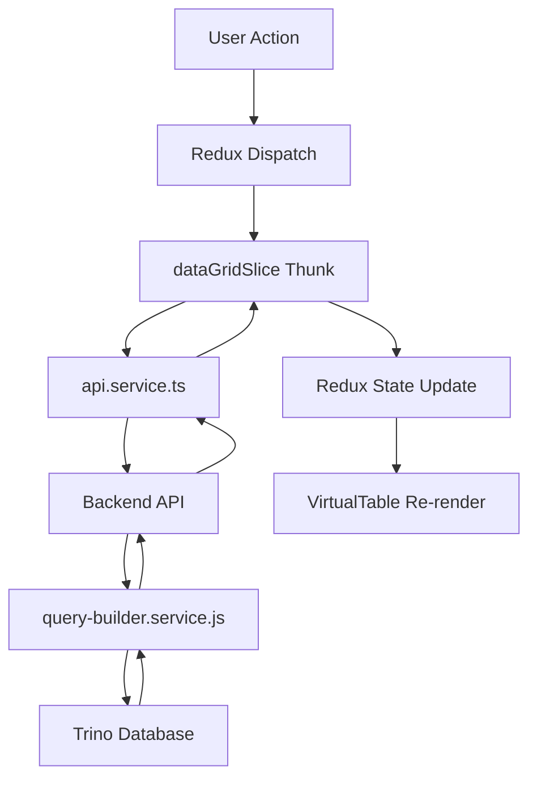

# DataGrid Component Architecture

A high-performance virtualized data grid with Power BI-style features including row grouping, infinite scroll, comparison mode, and brand filtering.

---

## 📁 Project Structure

```
frontend/src/
├── components/
│   ├── DataGrid/           # Main data grid component
│   │   ├── BrandFilter.*    → Brand filter dropdown
│   │   ├── DataGrid.*       → Grid container & state coordination
│   │   ├── DataGridToolbar.* → Toolbar (metrics, parameters, search)
│   │   ├── DrillDownSelector.* → Dimension picker modal
│   │   └── SearchBar.*      → Autocomplete search
│   └── VirtualTable/        # Core virtualized table
│       ├── VirtualTable.*   → Row virtualization & sticky headers
│       ├── useRowSpanning.ts → Row grouping calculation
│       └── useVirtualScroll.ts → Scroll position management
├── services/
│   └── api.service.ts       → Backend API client
├── store/
│   └── dataGridSlice.ts     → Redux state management
└── types/
    └── data.types.ts        → TypeScript interfaces

backend/src/
├── controllers/
│   └── data.controller.js   → REST API endpoints
└── services/
    ├── trino.service.js     → Trino/SQL query execution
    ├── query-builder.service.js → Dynamic SQL generation
    └── cache.service.js     → Query result caching
```

---

## 🔄 Data Flow



---

## 🛠 Technology Choices & Justifications

### Frontend

| Technology | Purpose | Why Better |
|------------|---------|------------|
| **React 18** | UI Framework | Component-based, excellent ecosystem, hooks for state |
| **Redux Toolkit** | State Management | Predictable state, async thunks, DevTools support |
| **Virtual Scrolling** | Performance | Only renders visible rows (40-50 vs 10,000+) |
| **CSS-in-File** | Styling | Collocated styles, no runtime overhead |
| **TypeScript** | Type Safety | Catches errors at compile time, better DX |

### Backend

| Technology | Purpose | Why Better |
|------------|---------|------------|
| **Express.js** | API Server | Lightweight, flexible, mature ecosystem |
| **Trino** | Query Engine | Distributed SQL, scales to petabytes |
| **Dynamic SQL Builder** | Query Generation | Safe, flexible, supports all filter types |
| **LRU Cache** | Performance | Avoids repeated expensive queries |
LRU Cache (Least Recently Used Cache) ek caching technique / data structure hota hai jisme recently use hua data ko rakha jata hai aur sabse purana (least recently used) data automatic remove ho jata hai jab cache full ho jaye.
---

## ⚡ Performance Optimizations

### 1. Virtual Scrolling (~95% fewer DOM nodes)
```typescript
// Only renders visible rows + overscan buffer
const visibleRows = data.slice(startIndex, endIndex);
```

### 2. Columnar Data Format (50% less payload)
```typescript
// Instead of: [{ name: "A", value: 1 }, { name: "B", value: 2 }]
// We use:     { columns: ["name", "value"], data: [["A", 1], ["B", 2]] }
```

### 3. Smart Prefetching
```typescript
// When user scrolls past 70%, prefetch next batch
if (scrollProgress >= 0.7 && hasMoreData) {
    dispatch(fetchDataRange({ offset, isPrefetch: true }));
}
```

### 4. Row Grouping (Power BI Matrix Style)
- Groups repeated dimension values
- Sticky labels float at viewport top
- No extra DOM elements per group

### 5. Request Deduplication
- Tracks loaded ranges to avoid re-fetching
- Cancels stale requests on filter/sort changes

---

## 🔌 Integration Guide

### 1. Install Dependencies
```bash
npm install @reduxjs/toolkit react-redux axios
```

### 2. Copy Component Files
Copy these directories to your project:
- `components/DataGrid/`
- `components/VirtualTable/`
- `services/api.service.ts`
- `store/dataGridSlice.ts`
- `types/data.types.ts`
- `hooks/useRedux.ts`

### 3. Setup Redux Store
```typescript
// store/index.ts
import { configureStore } from '@reduxjs/toolkit';
import dataGridReducer from './dataGridSlice';

export const store = configureStore({
  reducer: {
    dataGrid: dataGridReducer,
  },
});
```

### 4. Wrap App with Provider
```tsx
import { Provider } from 'react-redux';
import { store } from './store';
import { DataGrid } from './components/DataGrid';

function App() {
  return (
    <Provider store={store}>
      <DataGrid />
    </Provider>
  );
}
```

### 5. Configure API Endpoint
```typescript
// services/api.service.ts
const API_BASE_URL = 'https://your-backend-url.com';
```

---

## 📊 Key Features

| Feature | Description |
|---------|-------------|
| **Brand Filter** | Top-level dropdown with "All" option |
| **Metrics Toggle** | Show/hide metric columns + Select All |
| **Comparison Mode** | Current vs Prior period with diff columns |
| **Drill Down** | Add/remove dimension columns |
| **Search** | Autocomplete across all dimensions |
| **Infinite Scroll** | Progressive data loading |
| **Row Grouping** | Merged cells with sticky headers |
| **Sorting** | Click column headers |

---

## 🗄 Backend API Endpoints

| Endpoint | Method | Purpose |
|----------|--------|---------|
| `/api/data/metadata` | GET | Get available dimensions & metrics |
| `/api/data/query-raw` | POST | Execute data query (columnar format) |
| `/api/data/filters/:column` | GET | Get distinct values for filtering |
| `/api/data/search` | POST | Autocomplete search |
